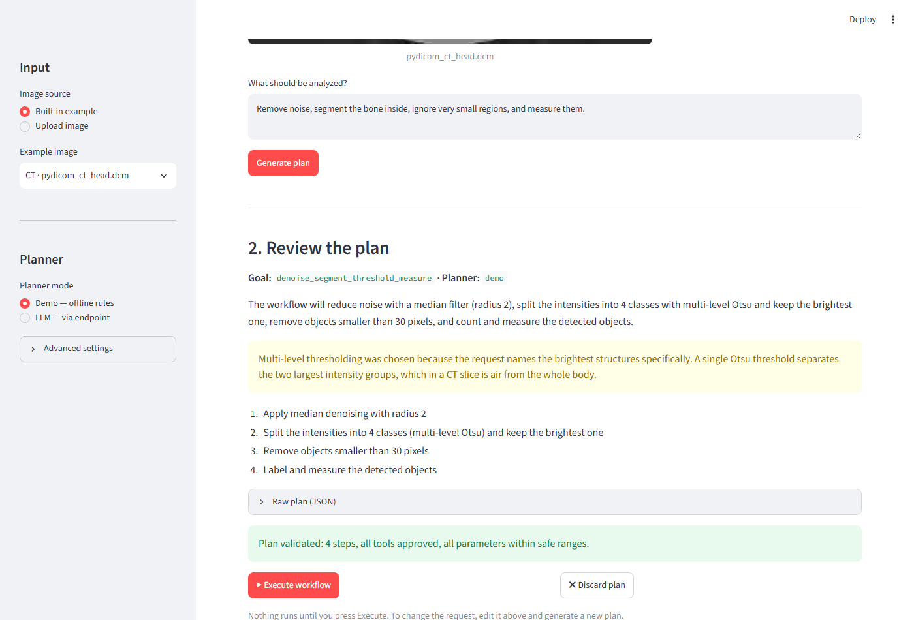
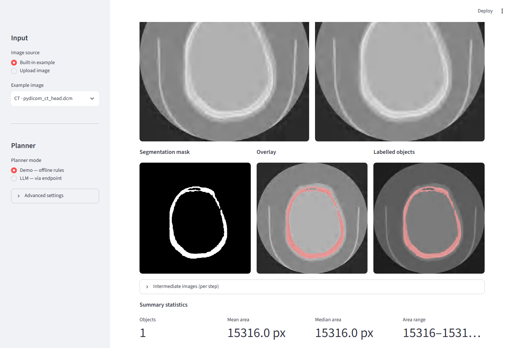

# 🔬 SciFlow Agent

[](https://github.com/shuvanon/SciFlow-Agent/actions/workflows/ci.yml)
[](LICENSE)
[](https://www.python.org/downloads/)

**Describe a scientific image-analysis task in plain language. SciFlow Agent plans it with
approved tools only, shows you the workflow, and runs it after your explicit approval.**

SciFlow Agent is a lightweight agentic application for 2D scientific-image analysis. A
planner — either an LLM behind any OpenAI-compatible endpoint, or a deterministic offline
demo planner — turns your request into a structured plan. The plan is validated against a
fixed tool registry, shown to you for approval, executed by a controlled runtime, and
summarized in a downloadable reproducibility report.

The language model **never executes code**. It can only propose approved tools with
validated parameters; three independent validation layers stand between model output and
execution.

```text
Select or upload an image
        ↓
"Remove noise, segment the bright objects,
 ignore very small regions, and measure them."
        ↓
Planner (demo rules or LLM) → structured JSON plan
        ↓
Validation: registry membership, parameter bounds, workflow order
        ↓
You review the plan — nothing runs without your approval
        ↓
Controlled execution → mask, overlay, per-object measurements
        ↓
Downloadable JSON / Markdown reproducibility report
```

## Screenshots

| Plan review and approval | Results |
|---|---|
|  |  |

*(Full walkthrough in [docs/screenshots/](docs/screenshots/).)*

## Measured, not promised

The benchmark (synthetic dataset, known ground truth, fixed seed) shows what the planned
pipeline adds over naive thresholding:

| Pipeline | Mean IoU | Mean Dice | Mean abs. count error |
|---|---|---|---|
| Otsu only | 0.828 | 0.890 | 912.0 |
| Otsu + cleanup | 0.948 | 0.973 | 0.0 |
| **Planner pipeline** (denoise → Otsu → cleanup) | **0.969** | **0.984** | **0.0** |

On the hardest case (`low_contrast`), raw Otsu produces 3 397 spurious objects (IoU 0.46);
the planned pipeline scores IoU 0.955 with an exact object count. Reproduce it with
`python benchmark/run_benchmark.py` — details in [benchmark/README.md](benchmark/README.md).

## Deep-learning segmentation (optional)

Beyond the classical tools, SciFlow Agent ships one **pretrained deep-learning segmentation
tool**, `segment_ml`, registered behind the *same* validation boundary as every other tool:
the planner selects it, the validator checks its parameters, the executor runs it, and it
never bypasses the safety model. The current model segments **lung fields in chest X-rays**
(torchxrayvision PSPNet).

It is an **optional extra** — the base app, demo mode, and every classical tool work without
it (the tool fails with a clear message if the extra is absent):

```bash
pip install -e ".[ml]"     # adds torch + torchxrayvision (large; GPU optional)
```

The tool **auto-detects a CUDA GPU** (falling back to CPU), and every run records the model
name, framework/torch versions, device, and the **weights SHA-256** in the reproducibility
report. Ask for it in plain language — *"Segment the lungs in this chest X-ray and measure
them."* — and try the built-in `example_chest_xray.png`.

**Classical vs deep learning** on real chest X-rays (Montgomery set, ground-truth lung masks):

| Pipeline | Mean Dice | Mean IoU |
|---|---|---|
| Otsu (bright) | 0.115 | 0.061 |
| Otsu (dark) | 0.542 | 0.384 |
| **`segment_ml`** (deep learning) | **0.870** | **0.770** |

Classical thresholding cannot isolate lungs — the brightest pixels are bone, so both
polarities fail; the model learned lung anatomy. Reproduce with
`python benchmark/run_cxr_benchmark.py` (needs the `[ml]` extra and the dataset — see
[docs/datasets.md](docs/datasets.md)).

### Medical images (DICOM)

SciFlow Agent reads **DICOM** (`.dcm`/`.dicom`) 2D images — chest X-rays and similar —
directly (RescaleSlope/Intercept applied, MONOCHROME1 inverted to the standard convention,
first frame of a multi-frame series). DICOM support needs **no extra dependencies**.

## Quickstart

Requires **Python 3.11+**.

```bash
# 1. Create and activate a virtual environment
python -m venv .venv
# Windows:            .venv\Scripts\activate
# Linux/macOS:        source .venv/bin/activate

# 2. Install dependencies
pip install -r requirements.txt

# 3. Run
streamlit run app.py
```

The app opens at `http://localhost:8501` and works immediately in **demo mode** — no API
key, no network. Two built-in example images are included.

### Docker

```bash
docker build -t sciflow-agent .
docker run -p 8501:8501 sciflow-agent
```

Configuration can be passed as environment variables, e.g.
`docker run -p 8501:8501 -e PLANNER_MODE=demo sciflow-agent`. The image never contains
your `.env` (excluded via `.dockerignore`). The image is deliberately lean: it runs demo
mode, all classical tools, and DICOM — the optional deep-learning tool (`[ml]`, ~GB of
PyTorch) is not baked in and is best run from a local GPU environment.

## Using the app

Full walkthrough with explanations of every panel and metric:
**[docs/user_guide.md](docs/user_guide.md)**. The short version:

1. Pick a built-in example or upload a PNG/JPG/TIFF/DICOM (sidebar).
2. Choose the planner mode: **Demo** (offline) or **LLM**.
3. Describe the analysis in the request box.
4. Click **Generate plan** and review the numbered steps + validation verdict.
5. Click **▶ Execute workflow** — nothing runs before this.
6. Inspect images, measurements, and statistics; download the report.

### Example requests

```text
Remove noise, segment the bright objects, ignore very small regions, and measure them.
Count the bright objects in this image.
Improve the contrast, segment bright regions, and ignore very small objects.
Segment the dark objects and ignore regions smaller than 100 pixels.
Denoise with radius 4 and count the cells.
Segment the lungs in this chest X-ray and measure them.   (deep-learning model, needs [ml])
```

Unsafe or out-of-scope requests ("run a shell command…", "train a neural network…") are
rejected with an explanation of what is supported.

## LLM mode

Copy [.env.example](.env.example) to `.env` and set:

| Variable | Default | Purpose |
|---|---|---|
| `PLANNER_MODE` | `demo` | Startup mode; switchable in the sidebar |
| `LLM_BASE_URL` | — | OpenAI-compatible endpoint |
| `LLM_API_KEY` | — | Key (omit for most local servers; never logged or reported) |
| `LLM_MODEL` | — | Model name as the server reports it |
| `LLM_TIMEOUT_SECONDS` | `120` | Raise for slow local models |
| `MAX_WORKFLOW_STEPS` | `8` | Safety cap on plan length |
| `MAX_IMAGE_WIDTH/HEIGHT` | `4096` | Maximum accepted image size |

Works with local servers (llama.cpp, Ollama `http://localhost:11434/v1`, LM Studio
`http://localhost:1234/v1`) and hosted aggregators like OpenRouter
(`https://openrouter.ai/api/v1`). Only the request text and image *metadata* are sent to
the endpoint — never the image itself. Malformed model output gets one repair retry with
validation feedback, then a clear error; demo mode always remains available as fallback.

## Approved tools

| Tool | Parameters |
|---|---|
| `convert_to_grayscale` | — |
| `denoise_median` | `radius` 1–5 |
| `enhance_contrast` | `clip_limit` 0.001–0.1 (CLAHE) |
| `segment_otsu` | `polarity` bright/dark |
| `segment_ml` | `model_name` (cxr_lung), `threshold` 0.05–0.95 — **deep learning, optional `[ml]`** |
| `clean_mask` | `minimum_object_size` 0–100 000, `fill_holes` |
| `measure_objects` | standard measurement set |

## Safety model

- Fixed tool registry — dispatch is a dictionary lookup; no other execution path exists.
- Strict Pydantic schemas: tool-name enum, unknown fields rejected, bounded parameters.
- Semantic validation: workflow order, step limit, unsupported-plan refusal.
- Explicit human approval before any execution (the execute button only exists for
  validated plans).
- No `eval`, no `exec`, no shell, no dynamic imports, no paths from model output.
- Secrets live in environment variables, are excluded from `repr()`, logs, error
  messages, and reports — enforced by tests.

Details: [docs/architecture.md](docs/architecture.md) · decision history:
[docs/decision_log.md](docs/decision_log.md)

## Development

```bash
pip install -r requirements-dev.txt
pytest              # full suite: unit, integration, headless UI (AppTest), ML (torch-free)
ruff check .        # lint
ruff format .       # format
python benchmark/run_benchmark.py        # reproduce the synthetic benchmark
python benchmark/run_cxr_benchmark.py    # classical vs ML on chest X-rays (needs [ml] + data)
python examples/run_pipeline_demo.py     # scripted end-to-end pipeline demo
```

The test suite runs **without** the `[ml]` extra (the deep-learning backend is mocked), so
CI stays fast and torch-free.

CI (GitHub Actions) runs lint, format check, tests, and a Docker build on every push.

### Python API

```python
from src.agent.planner import generate_plan
from src.config import load_config
from src.executor import execute_plan
from src.image_io import load_image_file
from src.plan_validator import validate_plan

config = load_config()
loaded = load_image_file("examples/example_cells.png")
plan = generate_plan(
    "Count the bright objects.", config=config, metadata=loaded.metadata, mode="demo"
)
validation = validate_plan(plan, channels=loaded.metadata.channels)
result = execute_plan(validation.normalized_plan, loaded.original)
print(result.summary.object_count)
```

## Project structure

```text
app.py                    Streamlit UI (wiring only — no analysis logic)
src/
  agent/                  Planners: demo rules, LLM client, prompts, plan schemas
  tools/                  Approved tools: preprocessing, segmentation, measurement, ML
  config.py               Env-based configuration
  image_io.py             Loading, validation, normalization, metadata + SHA-256
  plan_validator.py       Semantic plan validation
  tool_registry.py        The fixed registry (the only dispatch table)
  executor.py             Controlled workflow executor
  reporting.py            JSON/Markdown reproducibility reports
  visualization.py        Masks, overlays, labelled renderings
examples/                 Deterministic example images + demo scripts
benchmark/                Synthetic dataset, metrics, results (CSV/MD)
tests/                    200 unit, integration, and UI tests
docs/                     Architecture, decision log, screenshots
```

## Limitations

- **2D images only** — no z-stacks or 3D volumes; NIfTI is unsupported. (2D DICOM images,
  e.g. chest X-rays, *are* supported.)
- **Classical segmentation is threshold-based**: global Otsu; touching objects are not
  separated (no watershed yet), and heavily uneven illumination challenges it even with
  CLAHE. The optional `segment_ml` deep-learning tool currently covers only chest X-ray
  lung fields.
- Multi-page TIFFs: only the first page is used; 16-bit/float images are min–max rescaled
  to 8-bit for processing (original range recorded in metadata).
- The demo planner understands English keyword patterns only.
- LLM planning quality depends on the configured model; the validator guarantees safety,
  not plan quality.
- No user accounts, persistence, or experiment history; reports are per-run downloads.
- Not a medical device — no clinical decision support.

## Roadmap

- **Near-term**: additional thresholding methods, watershed separation, editable plans,
  saved workflow templates, CSV export of measurements, experiment history.
- **Model-based**: more pretrained models as registered tools (one — chest X-ray lungs —
  is already integrated via `segment_ml`); Cellpose / SAM / MONAI adapters, automatic model
  selection, image-quality assessment.
- **Medical & 3D**: NIfTI and 3D volumes (2D DICOM is already supported), MONAI transforms,
  volumetric measurement.
- **Platform**: FastAPI backend, MCP tool exposure, persistent job storage, remote
  execution workers.

## Troubleshooting

| Symptom | Fix |
|---|---|
| `streamlit: command not found` | Activate the venv, or run `python -m streamlit run app.py` |
| Port 8501 already in use | `streamlit run app.py --server.port 8502` |
| PowerShell blocks venv activation | `Set-ExecutionPolicy -Scope CurrentUser RemoteSigned`, then reactivate |
| "Could not connect to the LLM endpoint" | Check the server is running and `LLM_BASE_URL` matches (include `/v1`); demo mode always works |
| "The LLM did not respond within N s" | Raise `LLM_TIMEOUT_SECONDS` in `.env` (local models can be slow) |
| LLM returns HTTP 404/400 | `LLM_MODEL` must exactly match the model name the server reports (`GET <base>/models`) |
| "No objects detected" | Try the opposite polarity ("segment the *dark* objects"), lower the minimum size, or enhance contrast first |
| Upload rejected | Supported: PNG, JPG/JPEG, TIFF, DICOM up to 4096×4096 (configurable) |
| "segment_ml needs the optional ML dependencies" | Install the extra: `pip install -e ".[ml]"` |

## License

[MIT](LICENSE)
