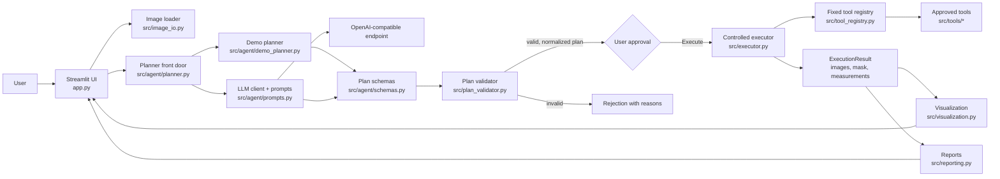
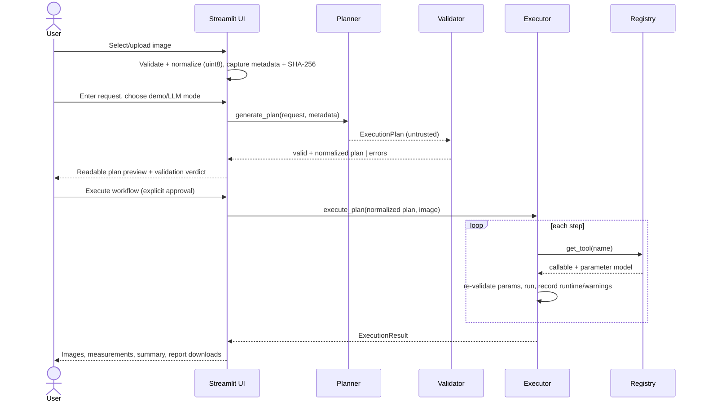

# SciFlow Agent — Architecture

SciFlow Agent converts a natural-language image-analysis request into a validated,
reproducible pipeline over a fixed set of approved tools. The language model (or the
offline demo planner) can only *propose* a plan; everything that executes passes through
schema validation, semantic validation, and a controlled executor that dispatches
exclusively from a frozen registry.

## Components

## End-to-end sequence

## Trust boundaries

Untrusted inputs — the user request, the uploaded image, and every byte of LLM output —
never touch executable machinery directly:

1. **Structural boundary** ([src/agent/schemas.py](../src/agent/schemas.py)): tool names are
   a strict `Literal` enum, every model rejects unknown fields, numeric parameters carry
   hard bounds imported from the tool modules (single source of truth), plans have a
   structural length cap.
2. **Semantic boundary** ([src/plan_validator.py](../src/plan_validator.py)): registry
   membership, per-tool parameter validation, workflow-order simulation over data-flow
   types (grayscale before grayscale-consuming tools, a mask before mask-consuming tools),
   the configured `MAX_WORKFLOW_STEPS` limit, and rejection of `supported: false` plans.
   Output is a *normalized* plan with defaults filled in — what the user reviews is
   byte-identical to what runs and what the report records.
3. **Execution boundary** ([src/executor.py](../src/executor.py) +
   [src/tool_registry.py](../src/tool_registry.py)): dispatch is a dictionary lookup into a
   frozen registry — no `eval`, no `exec`, no dynamic imports, no filesystem paths from
   plan content. Parameters are re-validated immediately before each call. Execution stops
   at the first failure, preserving prior results; stack traces go to logs only.

Prompting (system prompt, examples) is guidance for the model, never a security control.

## Tool registry

| Tool | Parameters (bounds) | Input → Output |
|---|---|---|
| `convert_to_grayscale` | — | image → grayscale |
| `denoise_median` | `radius` int 1–5 (default 2) | grayscale → grayscale |
| `enhance_contrast` | `clip_limit` float 0.001–0.1 (default 0.01, CLAHE) | grayscale → grayscale |
| `segment_otsu` | `polarity` bright\|dark (default bright) | grayscale → mask |
| `segment_ml` | `model_name` (cxr_lung), `threshold` 0.05–0.95 — deep learning, optional `[ml]` | image → mask |
| `clean_mask` | `minimum_object_size` int 0–100 000 (default 30), `fill_holes` bool | mask → mask |
| `measure_objects` | — (standard measurement set) | mask → table |

The registry entry also carries the human-readable description used to assemble the LLM
system prompt, so prompt and implementation cannot drift. A consistency test pins the
schema enum, the runtime name tuple, and the registry keys to each other.

### Deep-learning tools (the extensibility payoff)

`segment_ml` ([src/tools/ml_segmentation.py](../src/tools/ml_segmentation.py)) is a pretrained
model (torchxrayvision chest-X-ray lungs) wrapped as an ordinary `image → mask` tool. It
demonstrates that the registry boundary decouples the *model* from the *system*:

- **Optional dependency**: torch/torchxrayvision are imported lazily; the base app, demo
  mode, and the registry work without them, and executing the tool without the `[ml]` extra
  raises a clear `ToolInputError`. The executor and validator are **unchanged** — a neural
  network drops into the same slot as Otsu.
- **Controlled weights**: `model_name` is a whitelist; weights come from the library's pinned
  release, never from plan/LLM content. GPU is auto-detected with CPU fallback.
- **Provenance**: a `ToolDefinition.metadata_fn` hook lets the executor attach per-tool
  provenance (model name, framework + torch versions, device, **weights SHA-256**) to each
  step for the reproducibility report — without special-casing the tool in the executor.

Swapping in a TensorFlow/Keras, MONAI, or Cellpose model is a one-file adapter behind the same
interface; the system does not care which framework produced the mask.

## Image formats

PNG, JPG/JPEG, TIFF, and **DICOM** (`.dcm`/`.dicom`, 2D) are accepted. DICOM loading applies
RescaleSlope/Intercept, flips MONOCHROME1 to the standard convention, and uses the first frame
of a multi-frame series ([src/image_io.py](../src/image_io.py)). `pydicom` is a base
dependency, so DICOM needs no optional extra.

## Adding a new tool (NFR-04)

1. Implement the function in `src/tools/` (validate inputs, raise `ToolInputError`).
2. Define its parameter model in `src/agent/schemas.py` (bounds imported from the tool
   module).
3. Register it in `src/tool_registry.py` (callable, parameter model, input/output types,
   description).
4. Add the name to `AllowedToolName` and `ALLOWED_TOOL_NAMES` — the consistency test
   fails until all three places agree.
5. Add tests; optionally extend the demo planner's keyword rules.

The executor needs no changes: dispatch and order checking are driven by the declared
input/output types.

## Reproducibility

- Normalized plans: defaults filled in at validation; review, execution, and report all
  use the same object.
- Reports ([src/reporting.py](../src/reporting.py)): schema v1 pinned by tests — timestamp,
  software version, input metadata incl. SHA-256 of the original file bytes, request,
  planner mode, plan, per-step parameters and runtimes, summary, measurements, warnings,
  errors. Built only from explicit values; the configuration object (and thus any secret)
  can never reach a report.
- Deterministic assets: example images and the benchmark dataset are generated from fixed
  seeds; the benchmark records seed and library versions next to its results.

Implementation decisions and their rationale are tracked per phase in
[decision_log.md](decision_log.md).
